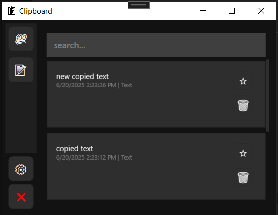

# SmartClipboard

**SmartClipboard** — 
is a simple and convenient clipboard manager for Windows that supports text, images, and files. Perfect for quick access to previously copied items and improved productivity.



---

## 🔧Features

- 📋Stores text, images, and files
- 📌Pin important items to keep them at the top
- ⏱Sort items by date or pin status
- 🧩Categorize entries by content type
- 🔍Content search
- 🧹Automatically clears clipboard on startup
- 🌗Light and dark theme support
- ⚙️Flexible settings:
  - Limit the number of stored items
  - Auto-start with Windows
- 💾Persists clipboard history between sessions using SQLite


---

## 🚀Installation and Usage

1. Download the `.exe` file from [GitHub Releases](https://github.com/IvanAfanasiev/SmartClipboard/releases/tag/V1.0).
2. Place it in a convenient location.
3. Run the executable.

---

## 📁Project Structure

```
SmartClipboard/
├── src/ #Main application (SmartClipboard)
│   └── SmartClipboard.sln
├── tests/ #Unit tests
│   └── SmartClipboard.Tests 
├── .gitignore
└── README.md
```
---

## 🧪Testing


The project is covered by unit tests using xUnit and Moq. The focus is on testing the logic inside `MainViewModel`.
Tests are located in the `SmartClipboard.Tests` project.
To run the tests:

```
dotnet test
```


⚙️System Requirements
-Windows 10 or newer
-.NET 8.0 Runtime

🛠Build Instructions
You can build the application using Visual Studio 2022+ or the .NET CLI:
```
dotnet publish -c Release -r win-x64 --self-contained true /p:PublishSingleFile=true /p:IncludeNativeLibrariesForSelfExtract=true
```
The resulting `.exe` file will be located at:

```
src/SmartClipboard/bin/Release/net8.0-windows/win-x64/publish/
```
